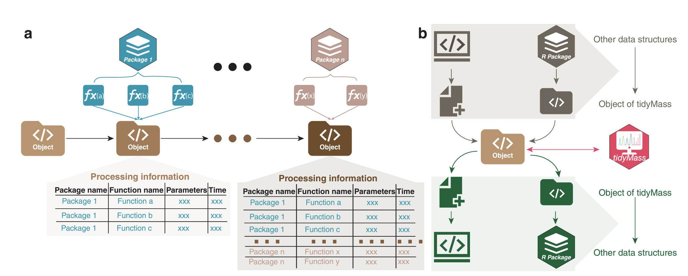
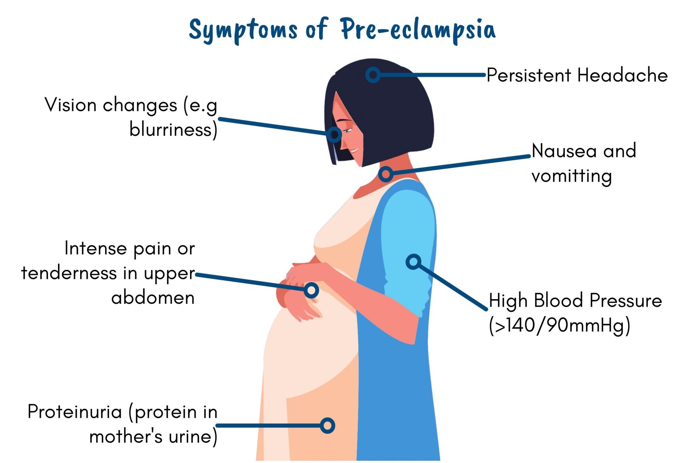

Our overarching research interests are bioinformatics algorithms development for multi-omics and wearable data, and their application to precision medicine and biological questions.

# 💻 Method Development For Multi-Omics and Wearable Data

## 🧬 Mass Spectrometry Data 

Mass spectrometry (MS) is an analytical technique used to measure the mass-to-charge ratio (m/z) of ions. It is a powerful tool for identifying the chemical structure of molecules in biological samples, including small molecules (metabolomics), proteins (proteomics), peptides (proteomics), and other biomolecules (lipidomics). We are working on the bioinformatics method and algorithm development (Deep Learning and Maching Learning) for Mass Spectrometry data processing and analysis, including whhole workflow of MS data, and metabolic network analysis. We are also working on the integration of MS data with other omics data, such as transcriptomics, proteomics and microbiome data (see below for more). 

## 🦠 Microbiome Data

Research is defined as the creation of new knowledge and/or the use of existing knowledge in a new and creative way so as to generate new concepts, methodologies and understandings. This could include synthesis and analysis of previous research to the extent that it leads to new and creative outcomes.

## ⌚ Wearable Data

Research is defined as the creation of new knowledge and/or the use of existing knowledge in a new and creative way so as to generate new concepts, methodologies and understandings. This could include synthesis and analysis of previous research to the extent that it leads to new and creative outcomes.

  
-----  
      
# Multi-Omics and Wearable Data Integration      
      
## Precisione Medicine and Biological Questions     

## 🧑 Aging
      
Research is defined as the creation of new knowledge and/or the use of existing knowledge in a new and creative way so as to generate new concepts, methodologies and understandings. This could include synthesis and analysis of previous research to the extent that it leads to new and creative outcomes.
      
      
      
      
## 🤰 Pregnancy

Research is defined as the creation of new knowledge and/or the use of existing knowledge in a new and creative way so as to generate new concepts, methodologies and understandings. This could include synthesis and analysis of previous research to the extent that it leads to new and creative outcomes.

## Personal Health Monitoring and Disease Early Diagnosis
